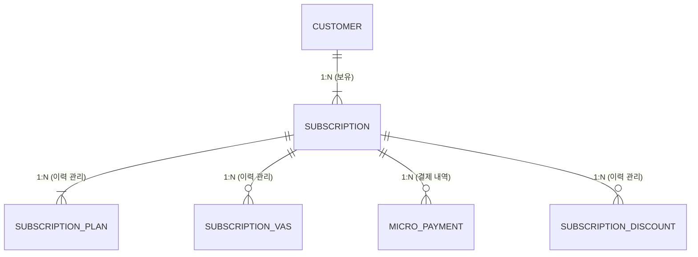
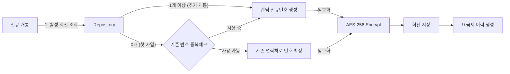
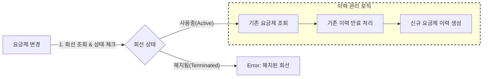

# Core Domain API

[](https://sonarcloud.io/summary/new_code?id=ureca-mini2-div4_template-backend)
[](https://sonarcloud.io/summary/new_code?id=ureca-mini2-div4_template-backend)

## 1. 프로젝트 개요
**유저 정보 관리**, **통신 서비스 가입**, **요금제 변경**, **부가서비스 관리**, **할인서비스 관리**, **소액결제 내역 처리**를 담당하는 Core 백엔드 모듈입니다. 대용량 트래픽과 데이터 환경을 고려하여 **이력 관리**와 **데이터 무결성**에 중점을 두고 설계되었습니다.

## 2. 기술 스택 (Tech Stack)

- Language: Java 17
- Framework: Spring Boot 3.x
- Database: PostgreSQL
- ORM: JPA (Hibernate)
- Security: AES-256 Encryption (개인정보 암호화)
- Build Tool: Gradle

## 3. 핵심 도메인 구조

고객(Customer)은 여러 회선(Subscription)을 가질 수 있으며 각 회선은 요금제(PLAN), 부가서비스(VAS), 소액결제(MICRO), 할인(DISCOUNT)의 이력을 관리합니다.



## 4. 핵심 로직

### 신규 개통 프로세스

고객이 회선을 새로 개통할 때 **기존 사용 번호 복구**와 **신규 번호 채번**을 자동으로 판단하는 로직입니다.

1. 유효성 검사:
   - 요청받은 고객 정보가 실제 DB에 존재하는지 확인합니다.

2. 번호 채번 정책:
   - 메인 번호 복구: 만약 고객이 현재 사용 중인 회선이 0개라면, 고객 정보에 등록된 연락처를 우선적으로 회선 번호로 할당하여 **쓰던 번호 그대로** 사용할 수 있게 합니다. (단, 타인이 사용 중이지 않을 경우)
   - 신규 번호 생성: 이미 회선이 있거나(투폰/서브폰), 기존 번호를 사용할 수 없는 경우, 시스템은 중복되지 않는 랜덤 전화번호를 새로 생성하여 할당합니다.

3. 회선 생성:
   - 확정된 전화번호는 AES-256 알고리즘으로 암호화되어 DB에 저장됩니다.

4. 초기 요금제 연결:
   - 회선 생성과 동시에, 선택한 요금제에 대한 첫 번째 이력 데이터를 관련 테이블에 생성합니다.



### 요금제 변경 프로세스

단순 업데이트가 아닌 **기존 이력을 만료시키고 새 이력을 쌓는** 방식으로 데이터의 시간적 변화를 추적합니다.

1. 상태 및 유효성 체크:
   - 변경하려는 회선이 존재하고, 현재 해지된 상태가 아닌지 확인합니다.

2. 기존 이력 만료:
   - SubscriptionPlan 테이블에서 현재 적용 중인 요금제 이력을 조회합니다.
   - 해당 레코드의 **종료일을 현재 시점으로 업데이트**하여, 해당 요금제의 효력을 만료시킵니다.

3. 신규 이력 생성:
   - 변경할 새로운 요금제 정보를 담은 **새로운 레코드를 INSERT**합니다.
   - 이 레코드의 시작일(created_date)은 현재 시점으로 설정되어 현재 유효한 요금제가 됩니다.


### 시스템 작동 흐름도 설명
```mermaid
flowchart LR

  %% STEP 1
  subgraph STEP1[STEP 1. 관리 대상 고객 선택]
    A[전화번호로 고객 검색]
    B[Customer Repository 조회]
    C[고객 userId 반환]

    A --> B --> C
  end

  %% STEP 2
  subgraph STEP2[STEP 2. 기능 수행]
    D[Customer 기능]
    E[Subscription 기능]
    F[Discount 기능]

    C --> D
    C --> E
    C --> F
  end

  %% Customer
  D --> D1[이메일 변경]
  D --> D2[고객 등급 변경]
  D1 --> DR1[Customer Repository 저장]
  D2 --> DR1

  %% Subscription
  E --> E1[회선 조회]
  E1 --> ER1[Subscription Repository]
  ER1 --> E2[보유 회선 반환]
  E2 --> E3[회선 선택]
  E3 --> E4[회선 상태 변경 저장]

  %% Discount
  F --> F1[할인 등록 또는 해지]
  F1 --> FR1[Subscription Repository 조회]
  FR1 --> F2[대상 회선 선택]
  F2 --> FR2[SubscriptionDiscount Repository]
  FR2 --> F3[할인 이력 처리]
  ```


### 고객 정보 관리 프로세스

관리자가 고객의 기본 정보를 변경할 때 수행되는 로직입니다.

1. 고객 조회:
   - 전화번호 검색을 통해 고객을 식별하고, 내부적으로는 userId 기준으로 관리합니다.

2. 이메일 변경:
   - 기존 고객 정보를 조회한 뒤 이메일을 변경하여 저장합니다.

3. 고객 등급 변경:
   - 고객 등급(GENERAL, VIP, VVIP)을 정책에 따라 변경하고 저장합니다.
     
### 회선 상태 변경 프로세스

고객이 보유한 회선의 상태를 관리자가 변경하는 로직입니다.

1. 회선 조회:
   - 고객이 보유한 모든 회선을 조회합니다.

2. 대상 회선 선택:
   - 관리자가 상태를 변경할 회선을 선택합니다.

3. 상태 변경:
   - 선택된 회선의 상태(사용중, 일시정지, 해지 등)를 변경하여 저장합니다.

### 할인 서비스 관리 프로세스

회선 단위로 할인 서비스를 등록하거나 해지하는 로직입니다.

1. 회선 조회:
   - 고객이 보유한 회선을 조회합니다.

2. 할인 대상 선택:
   - 할인 적용 또는 해지를 수행할 회선을 선택합니다.

3. 할인 처리:
   - 할인 등록 시 새로운 할인 이력을 생성하고,
     해지 시 기존 할인 이력을 종료 처리합니다.

## Why?

### Customer(1) : Subscription(N) 구조의 이유

현대 사용자는 메인 스마트폰 외에도 서브 폰 등 여러 회선(Multi-Device)을 보유할 수 있습니다.

이를 `1 : 1`로 강제하면 데이터 중복이 발생하고 통합 관리가 불가능해집니다.

### 이력 관리의 이유

만약 이력을 관리하지 않고 현재 요금제 정보만 덮어쓰기 한다면?

사용자의 과거 데이터가 유실되어 월 중 요금제를 변경했다면 요금 추적이 어려워집니다.

사용자의 변경 이력을 모두 추적하여 정확하게 계산할 수 있습니다.

### AES-CBC 사용 이유

동일한 평문이라도 매번 다른 암호문이 생성되도록 하여 데이터 패턴 분석을 차단하기 위함입니다.

만약 같은 전화번호라도 저장될 때마다 완전히 다른 암호문으로 변환되므로 개인정보를 안전하게 보호할 수 있습니다.
