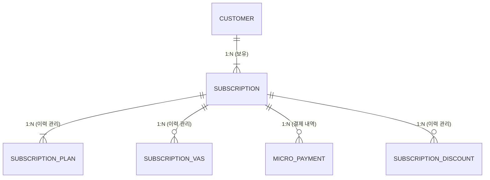
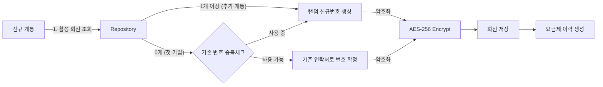
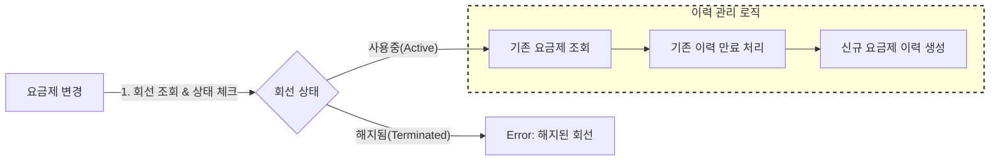

# Core Domain API

## 1. 프로젝트 개요
**유저 정보 관리**, **통신 서비스 가입**, **요금제 변경**, **부가서비스 관리**, **할인서비스 관리**, **소액결제 내역 처리**를 담당하는 Core 백엔드 모듈입니다. 대용량 트래픽과 데이터 환경을 고려하여 **이력 관리**와 **데이터 무결성**에 중점을 두고 설계되었습니다.

## 2. 기술 스택 (Tech Stack)

- Language: Java 17
- Framework: Spring Boot 3.x
- Database: PostgreSQL
- ORM: JPA (Hibernate)
- Security: AES-256 Encryption (개인정보 암호화)
- Build Tool: Gradle

## 3. 핵심 도메인 구조

고객(Customer)은 여러 회선(Subscription)을 가질 수 있으며 각 회선은 요금제(PLAN), 부가서비스(VAS), 소액결제(MICRO), 할인(DISCOUNT)의 이력을 관리합니다.

## 4. 핵심 로직

### 신규 개통 프로세스

고객이 회선을 새로 개통할 때 **기존 사용 번호 복구**와 **신규 번호 채번**을 자동으로 판단하는 로직입니다.

1. 유효성 검사:
   - 요청받은 고객 정보가 실제 DB에 존재하는지 확인합니다.

2. 번호 채번 정책:
   - 메인 번호 복구: 만약 고객이 현재 사용 중인 회선이 0개라면, 고객 정보에 등록된 연락처를 우선적으로 회선 번호로 할당하여 **쓰던 번호 그대로** 사용할 수 있게 합니다. (단, 타인이 사용 중이지 않을 경우)
   - 신규 번호 생성: 이미 회선이 있거나(투폰/서브폰), 기존 번호를 사용할 수 없는 경우, 시스템은 중복되지 않는 랜덤 전화번호를 새로 생성하여 할당합니다.

3. 회선 생성:
   - 확정된 전화번호는 AES-256 알고리즘으로 암호화되어 DB에 저장됩니다.

4. 초기 요금제 연결:
   - 회선 생성과 동시에, 선택한 요금제에 대한 첫 번째 이력 데이터를 관련 테이블에 생성합니다.

### 요금제 변경 프로세스

단순 업데이트가 아닌 **기존 이력을 만료시키고 새 이력을 쌓는** 방식으로 데이터의 시간적 변화를 추적합니다.

1. 상태 및 유효성 체크:
   - 변경하려는 회선이 존재하고, 현재 해지된 상태가 아닌지 확인합니다.

2. 기존 이력 만료:
   - SubscriptionPlan 테이블에서 현재 적용 중인 요금제 이력을 조회합니다.
   - 해당 레코드의 **종료일을 현재 시점으로 업데이트**하여, 해당 요금제의 효력을 만료시킵니다.

3. 신규 이력 생성:
   - 변경할 새로운 요금제 정보를 담은 **새로운 레코드를 INSERT**합니다.
   - 이 레코드의 시작일(created_date)은 현재 시점으로 설정되어 현재 유효한 요금제가 됩니다.

### 시스템 작동 흐름도 설명

flowchart TB
  %% =========================
  %% STEP 1: 관리자 유저 선택
  %% =========================
  subgraph STEP1["STEP 1 : 관리자 유저 선택"]
    direction LR
    S1A["유저 검색(전화번호)"] -->|조회| S1B["Customer Repository"]
    S1B --> S1C["유저 id만 반환"]
  end

  %% =========================
  %% STEP 2: 기능 수행
  %% =========================
  subgraph STEP2["STEP 2 : 기능 수행"]
    direction TB

    %% ---- Customer ----
    subgraph CUST["Customer"]
      direction TB

      C1["이메일 변경"] -->|조회| C2["Customer Repository"] --> C3["이메일 변경/저장"]
      C4["유저 등급 변경 (general,vip,vvip)"] -->|조회| C5["Customer Repository"] --> C6["유저등급 변경/저장"]
    end

    %% ---- Subscription ----
    subgraph SUBS["subscription"]
      direction LR
      S2A["회선 상태 변경"] -->|조회| S2B["Subscription Repository"]
      S2B --> S2C["보유중인 회선 반환 (클라이언트)"]
      S2C --> S2D["상태를 변경할 회선 선택"]
      S2D -->|조회| S2E["Subscription Repository"]
      S2E --> S2F["회선 상태 변경/저장"]
    end

    %% ---- Subscription Discount ----
    subgraph DISC["subscription_discount"]
      direction LR
      D1["할인 등록/해지"] -->|조회| D2["Subscription Repository"]
      D2 --> D3["보유중인 회선 반환 (클라이언트)"]
      D3 --> D4["상태를 변경할 회선 선택"]
      D4 -->|조회| D5["subscription_discount Repository"]
      D5 --> D6["할인 등록 / 해지"]
    end
  end

  %% STEP1 -> STEP2 연결(선택된 유저로 기능 수행)
  S1C --> STEP2

본 다이어그램은 관리자 시스템에서 고객을 선택한 후,
Customer / Subscription / Subscription Discount 도메인별 관리 기능이
어떤 순서로 동작하는지를 나타낸 흐름도이다.

전체 흐름은 크게 두 단계로 구성된다.

STEP 1은 관리 대상 고객 선택 단계로,
관리자가 전화번호로 고객을 검색하면 CustomerRepository를 통해
고객을 조회하고, 이후 단계에서는 고객 식별을 위해 userId만 반환한다.
이를 통해 개인정보 노출을 최소화하고,
모든 관리 기능이 동일한 진입 흐름을 가지도록 설계되었다.

STEP 2는 실제 관리 기능 수행 단계로,
선택된 고객을 기준으로 도메인별 기능이 분리되어 실행된다.

Customer 영역에서는 이메일 변경과 고객 등급 변경 기능을 제공하며,
모든 변경은 CustomerRepository를 통해 조회 후 저장된다.

Subscription 영역에서는 고객이 보유한 회선 목록을 조회한 뒤,
관리자가 상태를 변경할 회선을 선택하여
회선 상태를 변경하고 저장하는 흐름으로 구성된다.

Subscription Discount 영역에서는
고객의 회선을 기준으로 할인 적용 또는 해지 대상을 선택하고,
SubscriptionDiscountRepository를 통해
할인 이력을 등록하거나 종료 처리한다.
